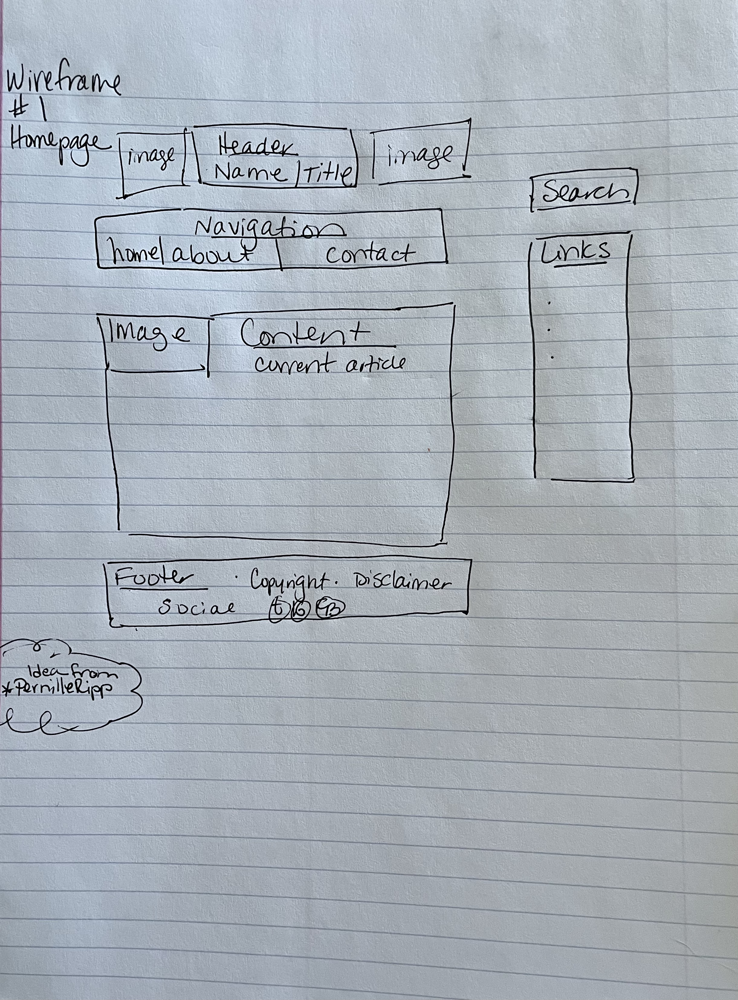
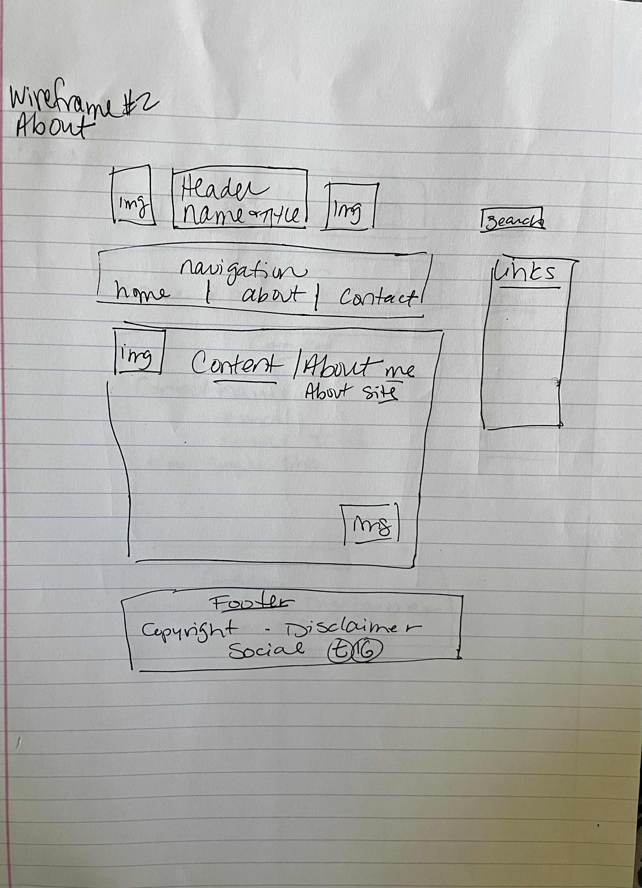
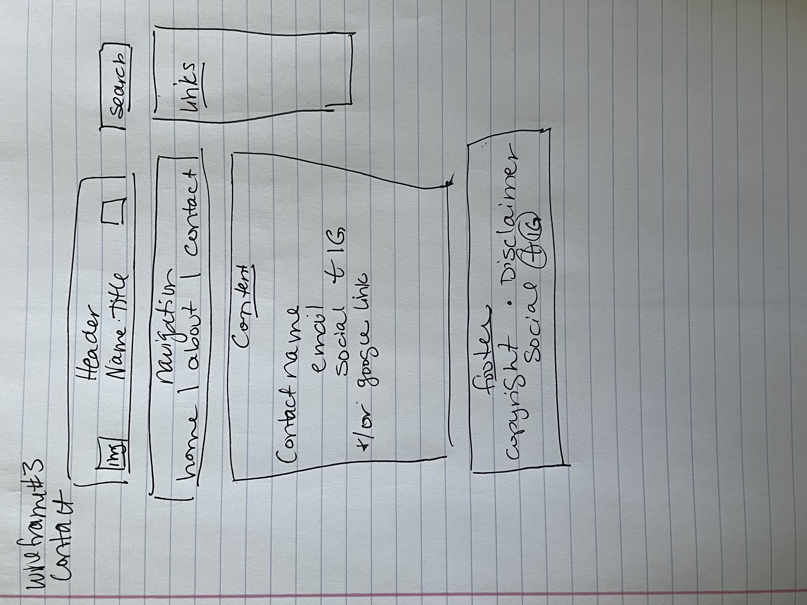

# Angie Moore's INF6420 Project 

A booklist and reccomendation site.

## Wireframes 

I struggle with organizaton and spatial awareness, so these wireframes appear to be the best to keep my content streamlined and organized

Header-will include my name and site title

Navigation Menu-will include links to other pages including a contact page, about page, and link back to home page

Main content- Purpose of site 

Footer-Will contain copyright or CC information and social media links, and any disclaimers

Header-will include my name and site title

Navigation Menu-will include links to other pages including a contact page, about page, and link back to home page

Main content- Photo, introduction, why

Footer-Will contain copyright or CC information and social media links, and any disclaimers

Header-will include my name and site title

Navigation Menu-will include links to other pages including a contact page, about page, and link back to home page

Main content- how to contact me, email, social media

Footer-Will contain copyright or CC information and social media links, and any disclaimers

